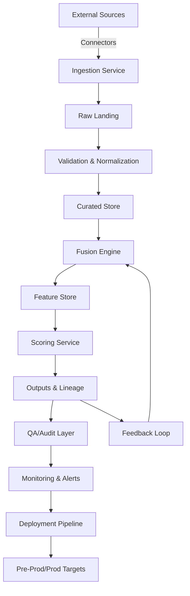

# MLPE System Architecture

## Overview
The Machine Learning Production Environment (MLPE) orchestrates data ingestion, fusion, scoring, QA/audit, and deployment within a shared control plane. It uses modular services to isolate concerns while enabling continuous feedback loops from downstream consumers back into model improvement.

## High-Level Flow
1. Source connectors pull batch and streaming data into the landing zone.
2. Ingestion services validate, normalize, and route records into curated stores.
3. Fusion logic assembles feature-ready datasets via deterministic joins and enrichment rules.
4. Scoring services load the fused datasets, execute models, and persist outputs with lineage.
5. QA and audit layers monitor data quality, model health, and compliance guardrails.
6. Delivery pipelines promote artifacts to pre-prod/prod with automated smoke and regression testing.

## Component Diagram

## Deployment Environments
- **Dev:** rapid iteration, synthetic data, lightweight validation.
- **Pre-Prod:** mirrors production schemas with masked data; full QA suite enabled.
- **Prod:** high-availability scoring with audit trails and roll-forward/rollback toggles.

## Interfaces & Contracts
- **APIs:** gRPC/REST endpoints for triggering ingestions and retrieving scores.
- **Schemas:** versioned Avro/Parquet contracts enforced at ingestion and fusion boundaries.
- **Lineage:** OpenLineage events emitted from ingestion, fusion, and scoring for traceability.

## Reliability & Security
- Idempotent ingestion jobs with checkpointing to recover from connector failures.
- Access control via OIDC-backed service accounts and signed artifact promotion.
- Encryption in transit (TLS) and at rest (KMS-managed keys) across stores.

Refer to the companion docs for detailed ingestion, scoring, QA/audit, and delivery plans.
